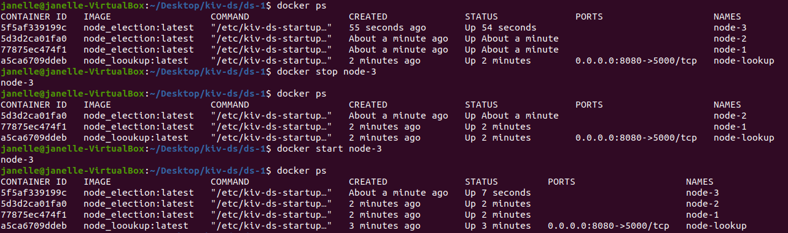
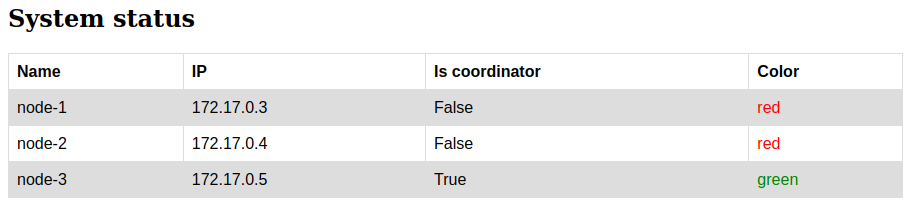
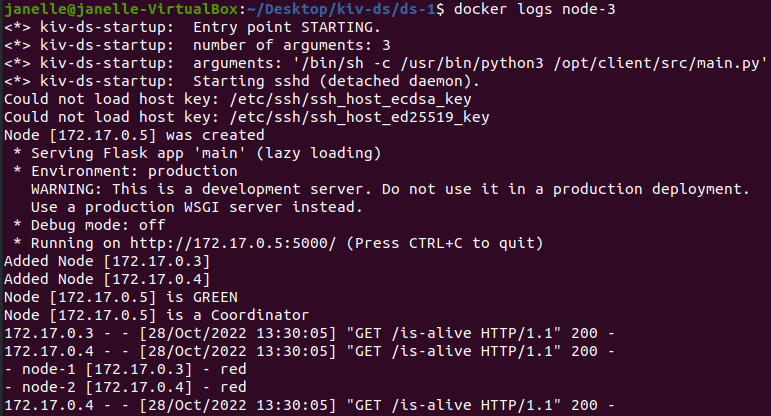

# Assignment #1

Objective of this task is to implement a distributed application for election of one master node (coordinator) from N identical nodes. 
After selection of the master node, application controls the "coloring" of nodes with following rules:

* Master must be always `GREEN`
* 1/3 of nodes will be `GREEN`
* 2/3 of nodes will be `RED`

## General info

This project uses **Bully algorithm** to elect a master node.

### Assumptions

* Each node knows the IP of every other node.
* A process initiates an election if it notices that the coordinator has failed.

### Algorithm Details

* Each node N is traversing through all other nodes
* The Coordinator does have largest IP number 
* Coorinator sends `set-coordinator` message for all nodes 

## Requirements

* **Vagrant**
* **Docker**

## Build and run


### Settings

Change node count is possible in `Vagrantfile` on line number `2`:

```bash
# Number of nodes to start:
NODES_COUNT = 3
```

### Run

To start vagrant In main folder `/ds-1` run command:

```bash
vagrant up
```

### Interaction

For functionality testing user can use following command for stop node

```bash
docker stop *container name*
```

and start it again:

```bash
docker start *container name*
```

Example:



User is able to use [http://172.17.0.2:5000/info](http://172.17.0.2:5000/info) adress for displaying all nodes status and colors. 



The same information is available in Coordinator node logs:

```bash
docker logs *coordinator container name*
```

