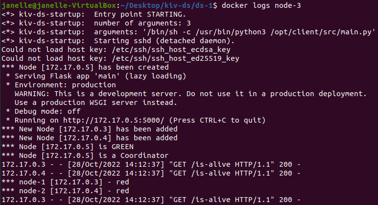

# Assignment #1

The objective of this task is to implement a distributed application for election of one master node (coordinator) from N identical nodes. 
After selection of the master node, application controls the "coloring" of nodes with following rules:

* Master must be always `GREEN`
* 1/3 of nodes will be `GREEN`
* 2/3 of nodes will be `RED`

## General info

This project uses **Bully algorithm** to elect a master node.

### Assumptions

* Each node knows the IP of every other node
* A process initiates an election if it notices that the coordinator has failed
* The Coordinator is always `green`
* After finding green and red nodes count, the first n nodes become `green` and the rest become `red`

### Algorithm Details

1. Each node is traversing through all other nodes
2. If there are no larger IP number in a node list, the current node becomes a Coordinator 
3. For updating the information, Coordinator sends `set-coordinator` message for all nodes for set a new coordinator IP
4. The Coordinator starts to control each node in the loop to prevent dead nodes
5. Other nodes are sending `is-alive` message for a coordinator for prevent dead coordinator
6. If coordinator is not responding, all nodes will start election process again (goto: 1. step)
7. Coloring process is starting after each election process

## Requirements

* **Vagrant**
* **Docker**

## Build and run


### Settings

Change node count is possible in `Vagrantfile` on line number `2`:

```bash
# Number of nodes to start:
NODES_COUNT = 3
```

### Run

To start vagrant use following command in main folder `/ds-1`

```bash
vagrant up
```

### Interaction

For functionality testing user can use following command for stop node

```bash
docker stop *container name*
```

and start it again:

```bash
docker start *container name*
```

Example:


User is able to use [http://172.17.0.2:5000/info](http://172.17.0.2:5000/info) address for displaying all nodes status and colors. 


The same information is also available in Coordinator node logs:

```bash
docker logs *coordinator container name*
```


